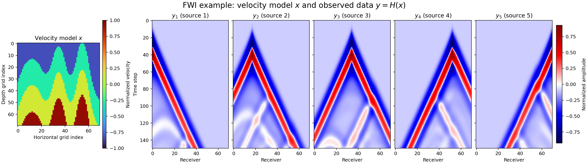
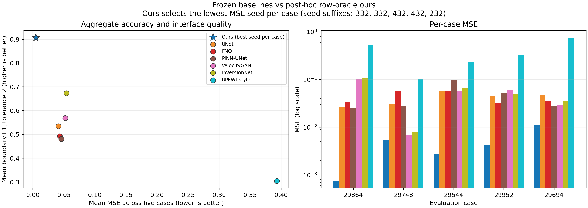

# Multi-Back Flow

**Optimization-Guided Flow Maps for Inverse Problems**

**Haoyang Jiang — William & Mary**

[](https://github.com/HaoyangJiang-WM/FWI/actions/workflows/tests.yml)
[](LICENSE)

> **Paper:** For the complete formulation, local analysis, and FWI study, see the [full paper in Markdown](paper/main.md) or the [LaTeX source](paper/main.tex).

Multi-Back Flow (MBF) adapts a **frozen unconditional Flow Map** to a new inverse problem at inference time. The generative prior remains fixed; measurement information enters only through the optimization objective.

The key idea is to replace a strictly monotone few-step trajectory with a controlled, non-monotone path. When a long Flow Map transition commits the reconstruction to a poor basin, MBF returns to an earlier generative time, applies a task-driven control, and moves forward again.

## Core idea

A standard controlled Flow Map trajectory follows

```math
z_{t_{i+1}}=\Phi_{t_{i+1}\leftarrow t_i}(z_{t_i}+B_i u_i),
\qquad 1=t_0>\cdots>t_K=0.
```

With only a few transitions, the trajectory exposes only a few control locations. The task gradient can therefore be poorly represented by the endpoint directions available to the monotone path.

MBF inserts a backward-forward control module:

```math
\mathcal{B}_{\tau,\rho}(z_\tau;b)
=\Phi_{\tau\leftarrow\rho}
\left(\Phi_{\rho\leftarrow\tau}(z_\tau)+Cb\right),
\qquad \tau<\rho.
```

The released implementation uses an anchored form:

```math
\mathcal{C}_{\tau,\rho}(x;b)
=x+\Phi_{\tau\leftarrow\rho}
\left(\Phi_{\rho\leftarrow\tau}(x)+b\right)
-\Phi_{\tau\leftarrow\rho}
\left(\Phi_{\rho\leftarrow\tau}(x)\right).
```

Hence $\mathcal{C}_{\tau,\rho}(x;0)=x$: zero Back control cannot alter the state through an imperfect numerical round trip.

Source, monotone, and Back controls are optimized jointly:

```math
\min_{c,b}\;
\mathcal{L}_y\bigl(x_{\mathrm{MBF}}(c,b)\bigr)
+\frac{1}{2}\lVert c\rVert_{\Lambda_c}^{2}
+\frac{1}{2}\lVert b\rVert_{\Lambda_b}^{2}.
```

## Relation to existing methods

| Method | Inference-time mechanism | Trajectory |
|---|---|---|
| DPS | Adds a likelihood gradient during reverse diffusion | Monotone diffusion chain |
| OGD | Optimizes controls along a frozen DDIM path | Monotone controlled chain |
| MBF | Jointly optimizes controls and reopens earlier generative times | **Non-monotone two-time Flow Map** |

MBF is therefore not a DPS update transplanted to Flow Maps. It is a trajectory-optimization method with explicit temporal recourse.

## FWI results

### What is FWI?

Full-waveform inversion (FWI) reconstructs a subsurface velocity model from seismic recordings. Let $x(\mathbf r)$ denote the velocity at spatial location $\mathbf r$. For source $s$, the acoustic wavefield $u_s$ satisfies

```math
\frac{1}{x(\mathbf r)^2}\frac{\partial^2 u_s(\mathbf r,t)}{\partial t^2}
-\nabla^2u_s(\mathbf r,t)=q_s(\mathbf r,t),
```

where $q_s$ is the source wavelet. Sampling the simulated wavefield at receiver locations defines the differentiable forward operator $H$:

```math
y_{s,r}(t)=[H(x)]_{s,t,r}+\varepsilon_{s,r}(t),
\qquad
\hat{x}=\arg\min_x\;\mathcal L\!\left(H(x),y\right)+\lambda R(x).
```

Here $y$ contains the observed receiver traces, $\varepsilon$ denotes measurement/modeling error, and $R$ is an optional prior or constraint. In this project, the frozen Flow Map supplies the prior and Multi-Back controls optimize waveform consistency through $H$; the Flow Map itself is not retrained.

For a concrete $x\rightarrow y$ example:

- $x\in\mathbb R^{70\times70}$ is one layered velocity image, where each pixel represents normalized subsurface velocity.
- $y=H(x)\in\mathbb R^{5\times150\times70}$ is its synthetic seismic record: five sources, 150 time steps, and 70 receivers. A single trace $y_{s,:,r}$ is the amplitude recorded over time at receiver $r$ after firing source $s$.



*Actual paired example from the project data-generation pipeline. The left panel is the velocity model $x$; the five right panels are the source gathers in $y=H(x)$. Receiver index is horizontal, time step is vertical, and color denotes normalized waveform amplitude.*

Thus, changing an interface in $x$ changes reflection arrival times and amplitudes throughout $y$. FWI solves the difficult inverse direction $y\mapsto x$, while the acoustic simulator evaluates the forward direction $x\mapsto H(x)$.

The repository also uses the name **public-$H$ key** for a lexicographic waveform-residual score used in truth-free source screening. That score is computed from $H(x)$ and $y$; it should not be confused with the forward operator $H$ itself. Its exact implementation is in [`public_h_metrics.py`](src/flowmap_multiback/public_h_metrics.py).

The current study uses one frozen Flow Map prior for synthetic full-waveform inversion, with five geological cases and five prespecified seeds per case.

### Baseline comparison



This figure compares frozen task-trained baselines with one post-hoc lowest-MSE MBF seed per case. It is a visualization of reconstruction quality, not an inference-time seed-selection rule.

### Full five-case by five-seed panel


This panel shows all 25 prespecified runs and is the main view of cross-seed behavior.

Machine-readable results are available in [`results/final_25_summary.json`](results/final_25_summary.json). FWI-specific acquisition, evaluation, and audit details are documented in [`docs/fwi_appendix.md`](docs/fwi_appendix.md).

## Quick start

```bash
python -m venv .venv
source .venv/bin/activate        # Windows: .venv\Scripts\activate
pip install -e ".[test]"
pytest -q
python analyze_final_panel.py
```

## Repository structure

```text
src/flowmap_multiback/   Core Multi-Back and evaluation utilities
tests/                   Algebraic and protocol tests
assets/figures/          Main result figures
results/                 Frozen aggregate records
docs/                    Theory and FWI details
paper/                   Markdown and LaTeX paper sources
```

## Scope

This repository is a compact method, paper, and audit release. Reproducing the complete FWI solver additionally requires the pretrained Flow Map checkpoint, benchmark tensors, and differentiable acoustic backend used by the research code.

## Paper and documentation

- [Markdown paper](paper/main.md)
- [LaTeX paper](paper/main.tex)
- [Theory notes](docs/theory.md)
- [FWI appendix](docs/fwi_appendix.md)

## Citation

```bibtex
@software{jiang2026multiback,
  author  = {Haoyang Jiang},
  title   = {Multi-Back Flow: Optimization-Guided Flow Maps for Inverse Problems},
  year    = {2026},
  version = {0.1.0},
  url     = {https://github.com/HaoyangJiang-WM/FWI}
}
```

## License

Copyright © 2026 Haoyang Jiang. Released under the [MIT License](LICENSE).
