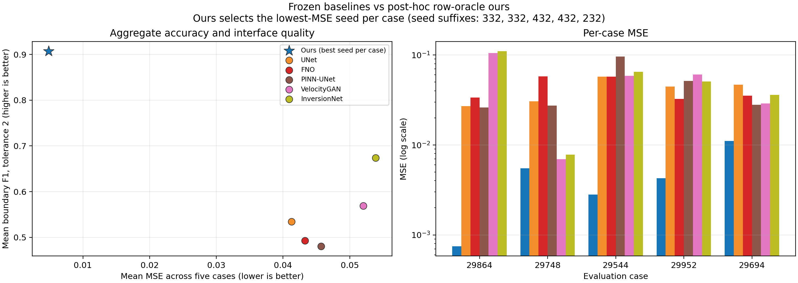

# Multi-Back Flow

**Optimization-guided, non-monotone control of frozen Flow Maps for inverse problems**

**Author:** Haoyang Jiang, William & Mary

[](https://github.com/HaoyangJiang-WM/FWI/actions/workflows/tests.yml)
[](LICENSE)

Multi-Back Flow (MBF) is an inference-time framework for adapting a **frozen unconditional generative Flow Map** to a new differentiable inverse problem. It does not retrain the generative prior and does not require the measurement operator to appear during prior training.

The central idea is simple: a few-step monotone flow trajectory can become trapped because it exposes only a small number of control locations. MBF treats generative time as a bidirectional optimization coordinate. It temporarily moves a trajectory state back to an earlier, noisier time, inserts a learnable control there, and transports the modified state forward again. These Back controls are optimized jointly with the source and ordinary trajectory controls.

This repository is a **minimal-core, paper, and audit release** for the current synthetic full-waveform inversion (FWI) case study. It is not yet a turnkey reproduction package for the complete historical research solver.

## Motivation

Let a pretrained two-time Flow Map

$$
\Phi_{t\leftarrow r}:\mathcal X_r\rightarrow\mathcal X_t
$$

transport states between arbitrary generative times. A standard few-step path follows a monotone schedule

$$
1=t_0>t_1>\cdots>t_K=0,
$$

with controlled transitions

$$
z_{t_{i+1}}=\Phi_{t_{i+1}\leftarrow t_i}(z_{t_i}+B_i u_i).
$$

Flow Maps make long transitions cheap, but a trajectory with only a few transitions also has only a few places where task information can modify the sample. An early long jump may commit the trajectory to a poor basin. Near the resulting endpoint, the measurement gradient may be weakly represented by the endpoint directions generated by the available controls.

MBF adds temporal recourse rather than merely taking more monotone steps.

## Method

### 1. Optimization-guided monotone trajectory

For an observation $y$, forward operator $\mathcal A$, and task loss

$$
\mathcal L_y(x)=\ell(\mathcal A(x),y),
$$

MBF starts from a source $\xi$ and optimizes optional source and trajectory controls while keeping $\Phi$ frozen:

$$
\min_{a,\{u_i\}}
\mathcal L_y(x_{\mathrm{mono}})
+\frac{\lambda_{\mathrm{src}}}{2}\|a\|^2
+\frac12\sum_i\lambda_i\|u_i\|^2.
$$

This is the Flow-Map analogue of the trajectory-control view used by Optimization-Guided Diffusion (OGD).

### 2. Multi-Back temporal recourse

For a state $z_\tau$ at a later, lower-noise time $\tau$, choose an earlier, higher-noise time $\rho>\tau$. A basic Back module is

$$
\mathcal B_{\tau,\rho}(z_\tau;b)
=
\Phi_{\tau\leftarrow\rho}
\left(\Phi_{\rho\leftarrow\tau}(z_\tau)+Cb\right).
$$

The control $b$ is inserted at the earlier generative scale and is optimized through the entire remaining trajectory. In the released implementation, an anchored form is used so that zero Back control leaves the incoming state exactly unchanged:

$$
\mathcal C_{\tau,\rho}(x;b)
=
x+
\Phi_{\tau\leftarrow\rho}
\left(\Phi_{\rho\leftarrow\tau}(x)+b\right)
-
\Phi_{\tau\leftarrow\rho}
\left(\Phi_{\rho\leftarrow\tau}(x)\right).
$$

Therefore $\mathcal C_{\tau,\rho}(x;0)=x$ even when the learned backward-forward round trip is imperfect.

### 3. Joint optimization

With ordinary controls $c$ and Back controls $b$, the endpoint is optimized through

$$
\min_{c,b}
\mathcal L_y(x_{\mathrm{MBF}}(c,b))
+\frac12\|c\|_{\Lambda_c}^2
+\frac12\|b\|_{\Lambda_b}^2.
$$

Locally, if $J_c$ and $J_b$ are endpoint Jacobians, the reachable first-order endpoint space expands from

$$
\mathrm{range}(J_c)
$$

to

$$
\mathrm{range}([J_c,J_b]).
$$

The local statement is modest but useful: when $J_c^\top g=0$ and $J_b^\top g\neq0$, Back controls provide a first-order descent direction that the current monotone parameterization does not provide. This is not a global recovery theorem.

## How MBF differs from related samplers

| Method | Where measurement information enters | Path structure | Fresh noise? | Prior retraining? |
|---|---|---|---|---|
| DPS | Per-step likelihood gradient through a denoised estimate | Monotone diffusion chain | No | No |
| DAPS | Clean-space posterior update followed by noise annealing | Repeated denoise/re-noise stages | Yes | No |
| OGD | Optimized controls on a fixed DDIM trajectory | Monotone diffusion chain | Not required | No |
| MBF | Jointly optimized controls on a two-time Flow Map | **Non-monotone backward-forward flow graph** | No | No |

MBF is therefore **not DPS**. DPS adds an approximate posterior gradient during reverse diffusion. MBF instead optimizes a controlled trajectory and deliberately reopens earlier generative scales through deterministic two-time Flow Map transitions.

## Source screening in the released FWI protocol

The current FWI implementation also screens eight fixed D4 transforms of the same realized source using measurement features. Each fixed transform preserves the source norm and isotropic-Gaussian pointwise density, but the adaptively selected source is not claimed to remain Gaussian-distributed.

The D4 screen is an implementation component of the reported FWI protocol, not the defining idea of MBF. The general method is the non-monotone controlled Flow Map formulation above.

## FWI case study

The released study uses:

- one frozen optimal-transport FlowMap prior trained on $70\times70$ synthetic geological models;
- a differentiable acoustic forward model;
- five evaluation cases crossed with five prespecified raw seeds;
- 25 frozen endpoint records;
- truth revealed only after each endpoint and evaluation record were frozen.

### Aggregate results

| Metric | Internal source stage | Final reopened endpoint |
|---|---:|---:|
| Mean MSE | 0.01424 | **0.00929** |
| Maximum observed MSE | 0.03219 | **0.02305** |
| Mean boundary F1, tolerance 2 | — | **0.89046** |
| MSE improved | — | 19 / 25 |
| Boundary F1 improved | — | 22 / 25 |
| Mean runtime | — | 2,978 s / sample |

The mean MSE decreases by 0.00495 from the recorded internal source stage to the final endpoint. MSE nevertheless worsens in 6 of 25 runs. Because the final solve jointly reopens source, monotone, and recourse variables, this comparison does **not** isolate a causal Multi-Back effect. A compute-matched factorial ablation remains necessary.

### Baseline visualization


This figure uses the lowest-truth-MSE seed separately for each case. It is explicitly a post-hoc row-oracle visualization, not an inference-time seed-selection rule or a compute-matched superiority claim.



### Complete five-case by five-seed panel


This panel displays all 25 runs and exposes the variation hidden by the row-oracle summary.

Machine-readable records are available in:

- [`results/final_25_summary.json`](results/final_25_summary.json)
- [`results/d4_public_h_decision_audit.json`](results/d4_public_h_decision_audit.json)

The canonical decision-ledger payload hash is

```text
094903548fe3908de71f191d253593c8d67c2df43ac2f3f9667fa328dd25e980
```

## Repository layout

```text
src/flowmap_multiback/   Core D4 ranking, anchored Multi-Back,
                         metrics, and reporting utilities
tests/                   Algebraic, metric, and protocol tests
assets/figures/          Paper and release figures
results/                 Frozen aggregate metrics and audit records
docs/                    Theory, FWI appendix, and matched protocol
paper/                   Markdown and LaTeX paper sources
analyze_final_panel.py   Fail-closed panel and ledger validation
plot_paper_figures.py    Regenerate public paper figures
```

## Installation and validation

```bash
python -m venv .venv
source .venv/bin/activate        # Windows: .venv\Scripts\activate
pip install -e ".[test]"
pytest -q
python analyze_final_panel.py
python plot_paper_figures.py
```

Run the commands from the repository root. The analyzer checks the balanced $5\times5$ panel, the $25\times8$ D4 ledger, record hashes, and the canonical release hash.

## Reproducibility boundary

The public release includes the core algebra, tests, figures, aggregate records, and audit logic. A complete FWI rerun additionally requires:

- the pretrained FlowMap checkpoint;
- benchmark tensors and split definitions;
- the differentiable acoustic backend;
- a stable solver interface connecting those components;
- the relevant licenses and artifact hashes.

The historical research solver is not copied into this clean release because it depends on private checkpoints, data adapters, and cluster-era modules. The shipped Figure 2 is therefore a frozen artifact; regenerating it requires retained field tensors from the research backend.

## Limitations and next experiments

- The current evidence covers one synthetic FWI acquisition family and one frozen prior.
- The method requires a differentiable objective and access to Flow Map derivatives through automatic differentiation, JVPs, or VJPs.
- Nonconvex trajectory optimization provides no global recovery guarantee.
- The current source-stage comparison is internal component attribution, not a compute-matched causal ablation.
- Matched external baselines, more independent cases, and additional inverse operators are still required.

The prespecified missing experiments are documented in [`docs/matched_experiment_protocol.md`](docs/matched_experiment_protocol.md). Their presence in the protocol does not imply that they have already been run.

## Paper and documentation

- [Readable Markdown paper](paper/main.md)
- [LaTeX paper source](paper/main.tex)
- [Theory notes](docs/theory.md)
- [FWI appendix](docs/fwi_appendix.md)
- [Matched experiment protocol](docs/matched_experiment_protocol.md)

## Citation

Please cite the software using [`CITATION.cff`](CITATION.cff).

```bibtex
@software{jiang2026multiback,
  author  = {Haoyang Jiang},
  title   = {Multi-Back Flow: Optimization-Guided Flow Maps for Inverse Problems},
  year    = {2026},
  version = {0.1.0},
  url     = {https://github.com/HaoyangJiang-WM/FWI}
}
```

## License

Copyright © 2026 Haoyang Jiang. The software is released under the [MIT License](LICENSE). Dataset files, pretrained checkpoints, and external dependencies may have separate licenses and are not relicensed by this repository.