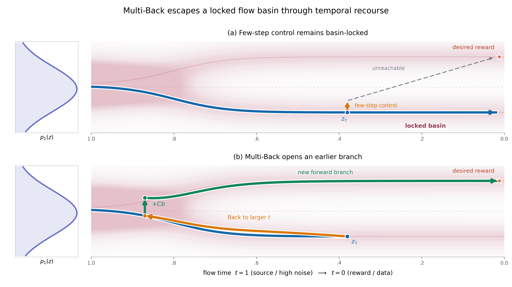

# Multi-Back Flow for Full-Waveform Inversion (FWI)

**Optimization-Guided Flow Maps for Inverse Problems**

**Haoyang Jiang — William & Mary**

[](https://github.com/HaoyangJiang-WM/FWI/actions/workflows/tests.yml)
[](LICENSE)

> **Paper:** See the [full paper in Markdown](paper/main.md) or the [LaTeX source](paper/main.tex) for the complete formulation, analysis, and experiments.

Multi-Back Flow (MBF) is a general inference-time framework for inverse problems. This repository focuses on its application to **full-waveform inversion (FWI)**, where a frozen unconditional Flow Map prior is used to recover subsurface velocity models from seismic waveforms. A brief introduction to FWI is provided [below](#what-is-fwi).

MBF keeps the generative prior frozen and introduces the forward operator and observations only through the inference objective. Its main idea is to replace a fixed monotone few-step trajectory with a controlled, non-monotone path: when a long Flow Map transition enters a poor reconstruction basin, MBF returns to an earlier generative time, applies a task-driven control, and moves forward again.

## Motivation

Supervised inverse models such as U-Net and InversionNet provide fast inference, but usually require task-specific paired data and are tied to the acquisition settings represented during training.

They may also produce overly smooth structures under ambiguity. With squared loss, the population-optimal deterministic predictor is

```math
f^\star(y)=\mathbb E[x\mid y].
```

When one observation is compatible with several sharp solutions, their conditional average may blur, displace, or superpose interfaces. This is not an inherent limitation of every U-Net reconstruction; it is a possible failure mode of deterministic pointwise regression under multimodal ambiguity.

Conditional generative models can represent richer outputs, but their conditioning mechanism is typically fixed during training. Frozen unconditional generative priors offer a more modular alternative. Methods such as DPS introduce measurements during reverse diffusion, but often require long denoising chains. OGD optimizes controls along a frozen DDIM path, but the path remains monotone.

MBF asks whether a short monotone path provides enough task-relevant control directions to escape an incorrect reconstruction basin.

## Flow Map prior

A two-time Flow Map directly transports a state between arbitrary generative times:

```math
\Phi_{t\leftarrow r}:\mathcal X_r\rightarrow\mathcal X_t.
```

For a schedule $1=t_0>\cdots>t_K=0$, few-step generation uses

```math
z_{t_{i+1}}
=
\Phi_{t_{i+1}\leftarrow t_i}(z_{t_i}).
```

Unlike a velocity model that must be integrated over each interval, a learned Flow Map performs long temporal transitions directly. Its two-time interface also allows generative time to be used as a bidirectional optimization coordinate.

## Multi-Back Flow



*Few-step control can remain trapped in a locally reachable basin. Multi-Back revisits an earlier, higher-noise time, applies a connected control, and follows a newly reachable branch toward the reward.*

A controlled monotone transition is

```math
z_{t_{i+1}}
=
\Phi_{t_{i+1}\leftarrow t_i}
\left(z_{t_i}+B_i u_i\right).
```

Few-step generation reduces model evaluations, but also provides fewer control locations. An early long transition can therefore determine the basin reached by the final reconstruction.

MBF inserts a backward-forward control module:

```math
\mathcal B_{\tau,\rho}(z_\tau;b)
=
\Phi_{\tau\leftarrow\rho}
\left(
\Phi_{\rho\leftarrow\tau}(z_\tau)+Cb
\right),
\qquad \tau<\rho.
```

The module returns the current state to an earlier generative time, inserts a Back control, and transports the modified state forward again. It is part of the same deterministic controlled trajectory, rather than a random restart or fresh-noise annealing step.

Source, monotone, and Back controls are optimized jointly:

```math
\min_{c,b}\;
\mathcal L_y
\left(
x_{\mathrm{MBF}}(c,b)
\right)
+
\frac{1}{2}\left\lVert c\right\rVert_{\Lambda_c}^{2}
+
\frac{1}{2}\left\lVert b\right\rVert_{\Lambda_b}^{2}.
```

Back controls add endpoint directions that may be unavailable to the current monotone path. The implementation also uses zero-control anchoring so that a zero Back control leaves the incoming state unchanged. See the [paper](paper/main.md) and [theory notes](docs/theory.md) for details.

## Relation to existing methods

| Method | Measurement conditioning | Trajectory | Task-specific training |
|---|---|---|---|
| Supervised inverse model | Learns $y\mapsto x$ from paired data | Single network evaluation | Yes |
| Conditional generative model | Learns the condition during training | Conditional generative path | Usually |
| DPS | Adds likelihood guidance during reverse diffusion | Monotone diffusion chain | No |
| DAPS | Alternates posterior refinement and noise annealing | Denoise/re-noise stages | No |
| OGD | Optimizes controls along a frozen DDIM path | Monotone controlled chain | No |
| MBF | Reopens earlier generative times during optimization | **Non-monotone Flow Map path** | No |

## What is FWI?

Full-Waveform Inversion reconstructs subsurface physical properties from recorded seismic waveforms.

For a spatially varying acoustic velocity $v(\mathbf r)$, the pressure field $p(\mathbf r,t)$ satisfies

```math
\frac{1}{v(\mathbf r)^2}
\frac{\partial^2 p(\mathbf r,t)}{\partial t^2}
-
\nabla^2 p(\mathbf r,t)
=
s(\mathbf r,t),
```

where $s(\mathbf r,t)$ is the seismic source.

Receivers sample the wavefield through an observation operator $P$:

```math
y
=
Pp(v)+\eta
=
\mathcal A(v)+\eta,
```

where $y$ contains the recorded seismic traces and $\eta$ represents measurement noise and modeling error.

Classical FWI estimates $v$ by solving

```math
\min_v\;
\frac{1}{2}
\left\lVert
\mathcal A(v)-y
\right\rVert_2^2
+
\lambda\mathcal R(v).
```

Its gradient can be written as

```math
\nabla_v\mathcal L_y(v)
=
D\mathcal A(v)^\top
\left(
\mathcal A(v)-y
\right),
```

and is commonly evaluated using the adjoint-state method.

FWI is highly nonconvex. Oscillatory waveform mismatch creates many local minima, and an inaccurate initial model may lead to cycle skipping. The problem is also underdetermined: different velocity structures can produce similar receiver measurements.

At the same time, realistic subsurface models contain sharp layers, faults, and interfaces. Deterministic regression may smooth these structures under ambiguity, while unconstrained waveform fitting may produce measurement-consistent but geologically implausible models.

FWI therefore provides a challenging test of whether a frozen generative prior can preserve geological structure while satisfying waveform observations.

## FWI case study

The current study uses:

- a frozen unconditional Flow Map trained on $70\times70$ geological velocity models;
- a differentiable acoustic forward operator;
- five geological evaluation cases;
- five prespecified raw seeds per case.

### Baseline comparison


The figure compares frozen task-trained baselines with MBF reconstructions. For each geological case, it displays the post-hoc lowest-truth-MSE result among the five prespecified MBF seeds.

This is a reconstruction-quality visualization, not an inference-time seed-selection rule or a compute-matched superiority claim.

### Complete five-case by five-seed panel


This panel shows all 25 prespecified runs and provides the main view of reconstruction variability across seeds.

Machine-readable results are available in [`results/final_25_summary.json`](results/final_25_summary.json). FWI acquisition settings, evaluation definitions, and audit details are documented in [`docs/fwi_appendix.md`](docs/fwi_appendix.md).

## Quick start

```bash
python -m venv .venv
source .venv/bin/activate        # Windows: .venv\Scripts\activate
pip install -e ".[test]"
pytest -q
python analyze_final_panel.py
```

## Repository structure

```text
src/flowmap_multiback/   Core Multi-Back and evaluation utilities
tests/                   Algebraic and protocol tests
assets/figures/          Main result figures
results/                 Frozen result records
docs/                    Theory and FWI implementation details
paper/                   Markdown and LaTeX paper sources
```

## Scope

This repository is a compact method, paper, and audit release. A complete FWI reproduction additionally requires the pretrained Flow Map checkpoint, benchmark tensors, differentiable acoustic backend, and the full optimization solver connecting these components.

## Paper and documentation

- [Full paper in Markdown](paper/main.md)
- [LaTeX source](paper/main.tex)
- [Theory notes](docs/theory.md)
- [FWI appendix](docs/fwi_appendix.md)

## Citation

```bibtex
@software{jiang2026multiback,
  author  = {Haoyang Jiang},
  title   = {Multi-Back Flow: Optimization-Guided Flow Maps for Inverse Problems},
  year    = {2026},
  version = {0.1.0},
  url     = {https://github.com/HaoyangJiang-WM/FWI}
}
```

## License

Copyright © 2026 Haoyang Jiang. Released under the [MIT License](LICENSE).
