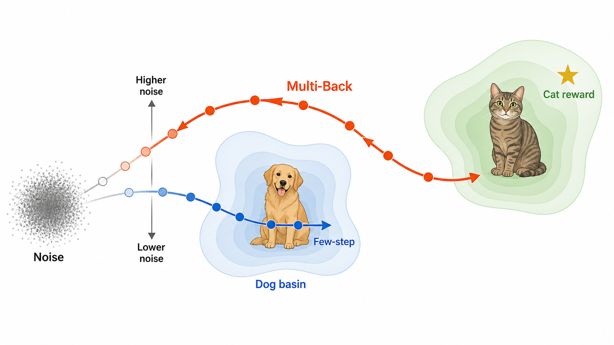
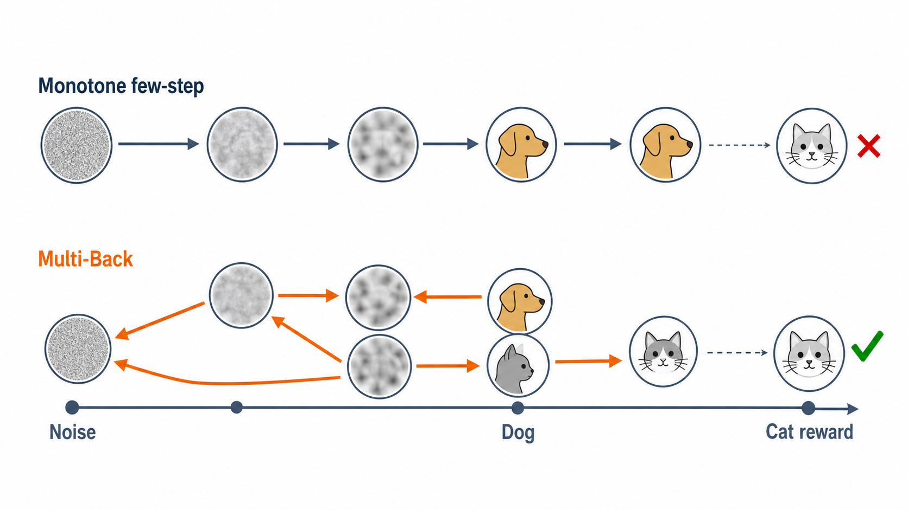
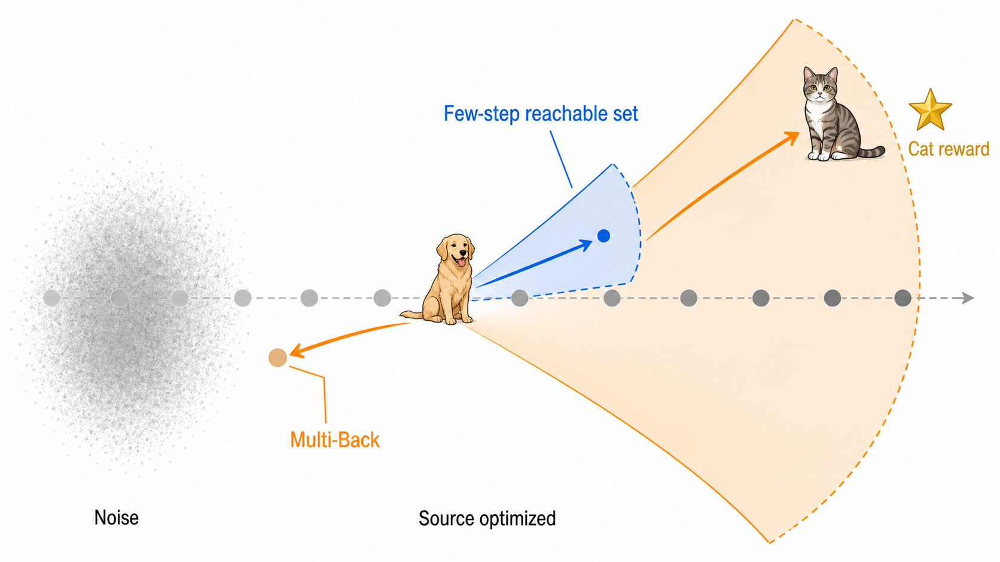

# Multi-Back motivation figure candidates

These are concept candidates, not final paper figures. They share the same motivation:

1. source optimization can commit a sparse, monotone trajectory to a semantically wrong basin;
2. the remaining few Flow Map steps expose limited endpoint directions and may not reach the reward-compatible basin;
3. Multi-Back revisits an earlier, noisier generative time, where semantic alternatives are less committed, and then moves forward under the task reward.

Multi-Back does not change the frozen model weights and does not guarantee recovery. The diagrams illustrate additional inference-time recourse.

## A. Basin recourse

The most direct motivation: few-step optimization remains in the dog basin, while Multi-Back reopens an earlier state and reaches the cat-reward basin.

## B. Trajectory fork

The closest to a standard flow/diffusion schematic: a monotone lane is contrasted with a non-monotone Multi-Back lane.

## C. Reachable-set view

The most method-oriented view: the local few-step reachable set misses the cat target, while recourse at an earlier time exposes a broader set of useful endpoint directions.

