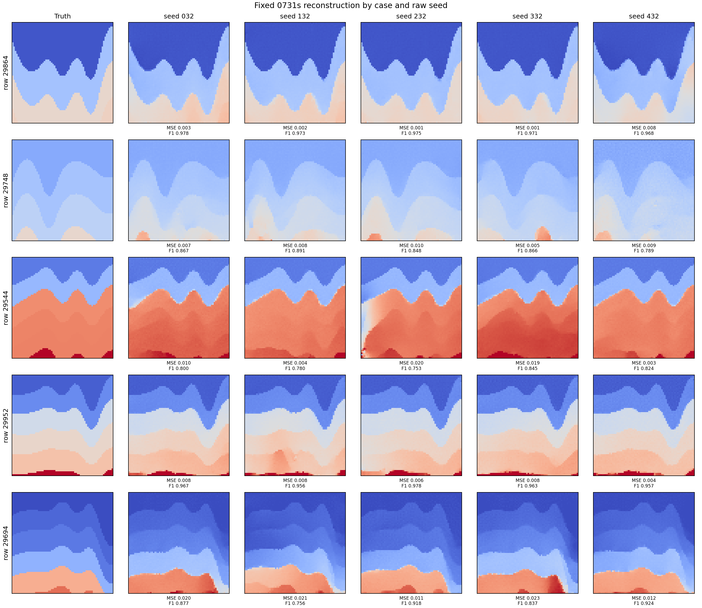
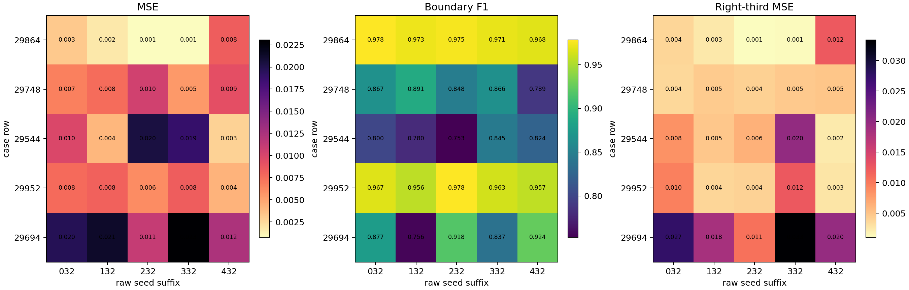
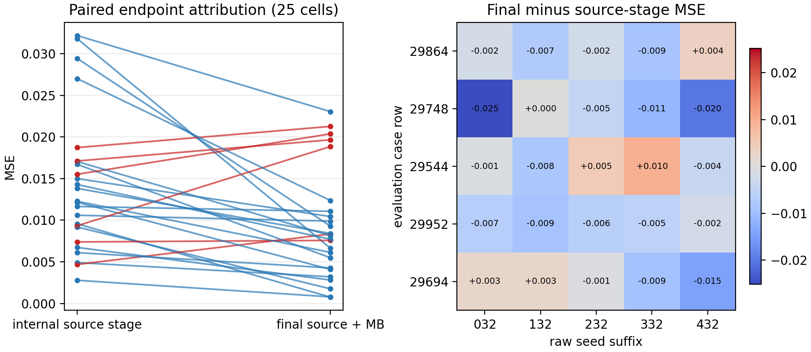

# Go Back to Move Forward: Measurement-Guided Recourse for a Frozen Generative Flow

**Anonymous Authors**

## Abstract

Frozen generative models encode structural priors, yet adapting them to new inverse problems remains difficult. In ambiguous inverse problems, deterministic regressors trained with pointwise losses can average across plausible interface locations. Task-specific conditional generators can favor sharper point predictions but often couple the conditioning modality or acquisition operator to training. We introduce **Symmetry-Screened Multi-Back**, an inference-time interface for a frozen unconditional flow map. The implementation ranks eight norm-preserving D4 source transforms using public measurement features, then optimizes exactly anchored trajectory controls against a differentiable observation loss. One endpoint is reported for every prespecified case–seed run without truth-based post-hoc selection.

On five synthetic full-waveform inversion (FWI) evaluation cases crossed with five seeds, the final endpoints obtain mean MSE **0.00929**, maximum observed MSE **0.02305**, and mean boundary F1 **0.8905**. Across this fixed panel, the final stage is associated with lower aggregate error than its recorded internal source checkpoint. These experiments assess repeatability and component attribution for one frozen flow prior—not superiority over external methods or a causal Multi-Back effect.

## 1. Introduction

Amortized inverse networks such as U-Nets [1] map measurements to a single reconstruction. With squared-error supervision, the population-optimal deterministic predictor is the conditional mean. If a measurement is compatible with several displaced but sharp interfaces, this mean superposes them and may therefore be smooth even when every plausible solution is sharp. This is a consequence of non-identifiability, a point-estimate objective, and finite data—not an architectural theorem about U-Nets.

Conditional adversarial generators [2] can represent sharper conditional outputs, but they amortize a particular family of conditions seen during training. Scaling this strategy to heterogeneous modalities, acquisition geometries, and forward operators requires those conditions to be represented, paired with targets, and covered by the training distribution. This is a coverage and interface burden rather than a fundamental limitation of GANs. We study an orthogonal axis: keeping the prior frozen and introducing a new differentiable operator only through an inference-time objective.

Pretrained score and flow models provide unconditional priors that can instead be conditioned at inference time [3,4]. Diffusion posterior sampling, for example, inserts a likelihood gradient into a pretrained sampling process [5]. This motivates testing whether non-monotone trajectory recourse can add useful inference-time directions while explicitly preventing zero-control improvements from numerical round-trip defects.

We treat the frozen trajectory as a small controllable system. The reported pipeline combines:

1. public-objective selection over fixed D4 source transforms;
2. exactly identity-anchored non-monotone recourse; and
3. joint endpoint optimization under a frozen public objective.

The inverse-task condition enters only at inference time; generator weights remain frozen. The broader foundation-model connection is a hypothesis rather than a demonstrated result. Anchored recourse may be applicable to frozen differentiable trajectory generators with accessible intermediate states and derivatives; the D4 screen is image- and symmetry-specific. This paper evaluates neither a foundation model nor cross-prior transfer.

## 2. Method

Let $\Phi_{t\leftarrow s}$ be a frozen differentiable flow, $A$ a differentiable observation operator, and $y$ a measurement. Given $\xi\sim\mathcal N(0,I)$ and fixed D4 action set $G$, every transform first receives the same fit-only source-probe budget:

$$
s_g^{\mathrm{probe}}
=\arg\min_{s\in\mathcal B_{\mathrm{probe}}}
\ell_{\mathrm{fit}}\!\left(A(R_0(Q_g\xi+s)),y_{\mathrm{fit}}\right).
$$

Candidates are ranked using held-out public measurement features:

$$
g^\star=\operatorname*{lexargmin}_{g\in G}
K_{\mathrm{sel}}\!\left(A_{\mathrm{sel}}(R_0(Q_g\xi+s_g^{\mathrm{probe}})),y_{\mathrm{sel}}\right).
$$

The winning transformed raw source is cached; its continuous source control and trajectory recourse are then reoptimized jointly:

$$
(s^\star,v^\star)=\arg\min_{s,v}
\ell_{\mathrm{pub}}\!\left(A(R(Q_{g^\star}\xi+s,v)),y\right)
\quad\text{s.t.}\quad \mathcal A(s,v)\le 1.
$$

Here $\mathcal B_{\mathrm{probe}}$ is the common probe budget, $R_0$ is the probe reconstruction, $K_{\mathrm{sel}}$ is a prespecified lexicographic measurement key, and $\mathcal A$ is the joint action constraint. Each candidate is optimized on a probe-fit acquisition subset and ranked on a disjoint source-selection subset. The latter is held out from probe fitting but used for model selection; it is not an independent test set. The probe displacement is not inherited: the winning transformed raw source is cached, and downstream $s$ is reoptimized with $v$. The endpoint solver jointly reopens all five implemented physical blocks. One chronological endpoint solve follows the finite screen, and one endpoint is reported. Ground truth is unavailable to every optimizer decision.

### 2.1 Norm-preserving D4 source screen

Each fixed $Q_g$ is an orthogonal permutation, so $\|Q_g\xi\|=\|\xi\|$ and the pointwise isotropic-Gaussian log density is unchanged. Because $g^\star$ depends on $(\xi,y)$, the distribution of selected sources need not remain Gaussian. We claim norm and density-level-set preservation per candidate, not preservation of the adaptively selected source law.

The key is computed independently on probe-fit and source-selection acquisition splits. Feasible D4 records are ordered lexicographically by selection key, fit key, and frozen D4 order. Exact key components and all $25\times8$ records are provided in the archival appendix and public ledger.

### 2.2 Exactly anchored Multi-Back

Suppose $x$ is at lower-noise time $\tau$ and $\tau<\rho$. We first move to the higher-noise time $\rho$, insert control $b$, and return:

$$
C_{\tau,\rho}(x;b)=x+
\Phi_{\tau\leftarrow\rho}\!\left(\Phi_{\rho\leftarrow\tau}(x)+b\right)
-\Phi_{\tau\leftarrow\rho}\!\left(\Phi_{\rho\leftarrow\tau}(x)\right).
$$

The controlled return is measured relative to its passive numerical round trip.

**Anchoring property.** For any frozen numerical maps in the equation above,

$$C_{\tau,\rho}(x;0)=x,$$

because the two return terms cancel. No invertibility or semigroup assumption is required. Zero Back control therefore cannot change the incoming state by exploiting a cycle defect. This is an algebraic identity, not a recovery theorem.

### 2.3 Local coupling interpretation

After projecting out fixed active constraints, partition a reduced damped local Gauss–Newton matrix into source $s$ and recourse $v$. If $H_{vv}$ is nonsingular, elimination gives the Schur complement

$$
S=H_{ss}-H_{sv}H_{vv}^{-1}H_{vs}.
$$

Formally profiling $v$ in this local quadratic model gives the expression above. We use it only to interpret source–recourse coupling; the endpoint solver performs blockwise nonlinear optimization and does not explicitly form or solve the full Schur system. This local interpretation supplies neither convergence nor recovery guarantees. Further details are separated into the [theory note](../docs/theory.md).

## 3. FWI Case Study

We use a frozen optimal-transport FlowMap trained as an unconditional $70\times70$ geological prior. A differentiable acoustic forward model maps the endpoint to receiver observations. Five evaluation rows (29864, 29748, 29544, 29952, 29694) are crossed with raw seeds 20268032–20268432. The algorithm, grid, action budget, and hashes are recorded in a frozen manifest before the remaining panel is run. Truth is opened only after each endpoint record is frozen and is used for post-decision MSE and boundary F1.

FWI-specific acquisition, checkpoint, split, exposure-history, and metric details are separated into the [archival appendix](../docs/fwi_appendix.md), keeping the main formulation task-agnostic.

### 3.1 Reconstruction comparison across seeds

*Figure 1. Truth and final reconstructions for five evaluation cases crossed with five prespecified raw seeds.*

### 3.2 Cross-seed metrics

*Figure 2. Five evaluation cases (rows) crossed with five prespecified raw seeds (columns). One endpoint is reported per cell without truth-based post-hoc seed or endpoint selection.*

The final endpoints obtain mean/maximum-observed MSE **0.00929/0.02305** and mean/minimum boundary F1 **0.8905/0.7526**. Mean runtime is 2,978 seconds per cell. The unit of task variation is the geological case ($n=5$); seeds are repeated runs within case. We therefore report the complete crossed panel and paired cell-wise attribution descriptively, without treating the 25 cells as independent samples or claiming population-level significance.

| Metric | Source stage | Final endpoint |
|---|---:|---:|
| Mean MSE | 0.01424 | **0.00929** |
| Maximum observed MSE | 0.03219 | **0.02305** |
| MSE improved | — | 19/25 |
| Boundary F1 improved | — | 22/25 |

*Table 1. Internal source-stage and final-endpoint metrics. The source stage is not a compute-matched independent baseline.*

### 3.3 Source-to-Multi-Back component attribution

*Figure 3. Internal source-stage to final-endpoint MSE changes. Blue denotes improvement and red regression. This is not a compute-matched independent baseline.*

Relative to the internal source stage, the final endpoint reduces mean MSE by **0.00495**. It improves MSE in 19/25 cells and worsens it in 6/25; boundary F1 improves in 22/25. This supports component attribution inside the implemented pipeline but does not identify a causal source–Multi-Back interaction. A compute-matched source off/on $\times$ Multi-Back off/on experiment is still needed for that claim.

## 4. Limitations and Conclusion

This technical draft contains only five geological cases, one synthetic acquisition family, and one frozen flow prior. It requires differentiable physics and intermediate trajectory access and is computationally expensive. Its D4 stage performs public-objective candidate selection, and the nonconvex solver has no global recovery guarantee. Matched external baselines, a source off/on $\times$ Multi-Back off/on experiment, uncertainty over more independent cases, and a licensed end-to-end release remain necessary for a formal submission.

Within this scope, inference-time source selection and exactly anchored recourse inject measurements without inverse-task retraining. The final endpoint has lower aggregate mean and maximum observed MSE than its recorded internal source stage; this is attribution, not a causal or compute-matched comparison. Broader applicability remains a hypothesis to test on new operators and priors.

## References

1. O. Ronneberger, P. Fischer, and T. Brox. “U-Net: Convolutional Networks for Biomedical Image Segmentation.” *MICCAI*, 2015.
2. P. Isola, J.-Y. Zhu, T. Zhou, and A. A. Efros. “Image-to-Image Translation with Conditional Adversarial Networks.” *CVPR*, 2017.
3. Y. Song et al. “Score-Based Generative Modeling through Stochastic Differential Equations.” *ICLR*, 2021.
4. Y. Lipman et al. “Flow Matching for Generative Modeling.” *ICLR*, 2023.
5. H. Chung et al. “Diffusion Posterior Sampling for General Noisy Inverse Problems.” *ICLR*, 2023.

---

Code, the auditable D4 decision ledger, exact metric definitions, and reproducibility notes are available in the [project README](../README.md).
