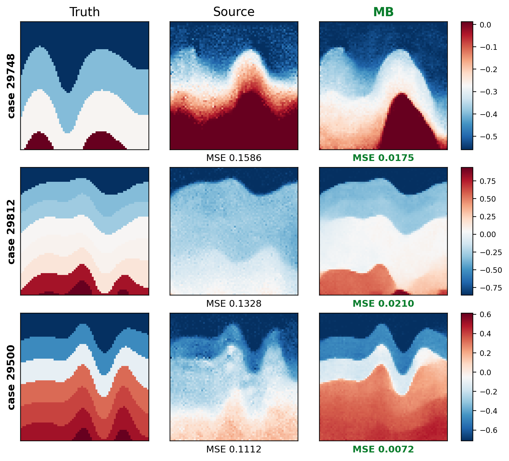

# Multi-Back Flow: Optimization-Guided Flow Maps for Inverse Problems

**Haoyang Jiang — William & Mary**

## Abstract

Pretrained generative models provide reusable priors for inverse problems, but conditioning them on a new measurement operator remains challenging. Supervised inverse networks offer fast inference yet couple the reconstruction rule to the operators and acquisition settings represented during training; under multimodal ambiguity, pointwise regression can further favor conditional averages. Diffusion posterior methods avoid task-specific retraining by introducing measurement information at inference time, but often require long denoising chains or repeated posterior refinement. Optimization-Guided Diffusion (OGD) instead optimizes controls along a frozen DDIM trajectory, providing a natural interface between a generative prior and a deployment objective.

We introduce **Multi-Back Flow (MBF)**, which extends optimization-guided generation from a fixed denoising chain to a non-monotone trajectory built from a frozen two-time Flow Map. Flow maps enable few-step generation through long temporal transitions, but a few-step monotone path exposes only a small number of control locations and can become locally locked when the task gradient is poorly represented by its endpoint control Jacobian. MBF inserts controlled backward–forward transitions to earlier generative times, where additional controls open endpoint directions unavailable to the monotone parameterization. The method optimizes source, monotone, and Back controls jointly while keeping the generative model frozen. We provide a local descent characterization of basin lock and show how Multi-Back controls restore first-order descent directions. A synthetic full-waveform inversion study demonstrates the current implementation; broader validation across operators and domains remains future work.

## 1. Introduction

Inverse problems seek to recover an unknown object $x$ from incomplete, noisy, or indirect observations $y$. A useful reconstruction must satisfy both measurement consistency and structural plausibility. Supervised deterministic inverse networks, including U-Net-style encoder–decoders and InversionNet, directly learn $f_\theta:y\mapsto x$ from paired data and provide fast inference [1,2]. Their reconstruction rule, however, is tied to the observation distributions and acquisition configurations represented during training. Moreover, under squared error the population-optimal deterministic predictor is $f^\star(y)=\mathbb E[x\mid y]$; when one observation is compatible with multiple sharp solutions, this conditional average can blur or superpose distinct modes [3]. Neural operators such as FNO learn mappings between function spaces and efficiently amortize repeated solves over a parameterized operator family, but inverse use still depends on the operators, parameter ranges, and discretizations covered by training [4]. Conditional generative models such as pix2pix and VelocityGAN can encourage sharper outputs through adversarial training, yet their conditioning interfaces remain tied to paired task-specific data [5,6].

Pretrained unconditional generative models provide a more modular alternative: the model learns a prior over solutions, while a new measurement operator enters only at inference time. Diffusion-based inverse methods have pursued this idea through several routes. Analytic methods exploit special linear structure; manifold- or likelihood-guided methods such as MCG, DPS, and $\Pi$GDM modify the reverse process using measurement information; optimization and resampling methods impose stronger data consistency in clean or latent space [7–11]. These approaches substantially broaden the reuse of a frozen prior, but commonly require repeated denoiser evaluations, forward-operator calls, or inner refinement across many noise levels. They also inherit strong path dependence from locally coupled denoising transitions. DAPS explicitly identifies the resulting difficulty of correcting early global errors and decouples consecutive noise levels through clean-space posterior sampling followed by fresh-noise annealing [12].

OGD offers a complementary optimization view: instead of directly adding an external guidance gradient to the sample, it replaces perturbations along a fixed DDIM trajectory with optimized controls, turning inference into constrained trajectory optimization while keeping the generator frozen [13]. This formulation is a natural starting point for general inverse and constrained-generation problems, but its controls remain attached to a prescribed monotone denoising chain. Flow Map Matching learns the two-time transport map of an underlying generative dynamics and supports long transitions between arbitrary generative times, enabling one- or few-step generation with a post-training choice of step count [14]. Replacing DDIM transitions with Flow Map transitions therefore reduces generative cost, but it does not remove the restriction to a monotone source-to-data path.

Few-step optimization makes this restriction especially important. For a schedule $1=t_0>\cdots>t_K=0$, at least one transition spans $1/K$ or more in generative time, while only $K$ locations are available for injecting ordinary controls. An early control is therefore propagated through a long transition and can strongly determine the basin reached by the remaining path. Near a locally restricted endpoint, the task gradient may have only a weak projection onto the endpoint directions generated by the monotone controls, producing **few-step basin lock**. We propose **Multi-Back Flow (MBF)** to address this failure mode. MBF treats generative time as a bidirectional optimization coordinate: it returns a trajectory state to an earlier generative time, applies a task-driven Back control, and transports the controlled state forward again. Multiple Back modules can be inserted at different scales and jointly optimized with the original trajectory controls.

Conceptually, MBF extends optimization-guided generation from control on a fixed chain to non-monotone control on a two-time flow graph. Unlike posterior re-noising, restart sampling, or DAPS-style annealing, MBF does not draw a fresh noisy posterior state; the backward–forward transition is part of a deterministic controlled trajectory. Our contributions are: (i) an optimization-guided formulation for few-step Flow Maps; (ii) a local characterization of few-step basin lock through the projected task gradient; (iii) Multi-Back temporal recourse that adds endpoint control directions from earlier generative scales; and (iv) a joint inference-time framework that accommodates general differentiable objectives and constraints without retraining the generative prior.

## 2. Preliminaries

### 2.1 Inverse problems with frozen generative priors

We consider observations $y=\mathcal A(x^\star)+\eta$, where $x^\star\in\mathcal X$ is unknown, $\mathcal A:\mathcal X\to\mathcal Y$ is a known forward operator, and $\eta$ is measurement noise. A task loss $\mathcal L_y(x)=\ell(\mathcal A(x),y)$ measures consistency; for Gaussian noise, $\mathcal L_y(x)=\|\mathcal A(x)-y\|^2/(2\sigma_y^2)$. Additional constraints may be written as $g_j(x)\le0$ and $h_\ell(x)=0$. The generative prior is pretrained independently of $\mathcal A$ and remains frozen during inference.

### 2.2 Optimization-Guided Diffusion

A stochastic DDIM transition can be written schematically as $x_{k-1}=\mu_\theta(x_k,k)+\sigma_k\omega_k$, with $\omega_k\sim\mathcal N(0,I)$. OGD replaces $\omega_k$ with an optimized correction $\delta_k$ and solves a trajectory-level objective such as

$$
\min_{x_K,\{\delta_k\}}\;\mathcal L_y(x_0)+\frac{\lambda_K}{2}\|x_K\|^2+\frac12\sum_{k=1}^K\lambda_k\|\delta_k\|^2,
\quad x_{k-1}=\mu_\theta(x_k,k)+\sigma_k\delta_k.
$$

The quadratic control cost limits deviation from the frozen generative trajectory, while the task term enforces deployment objectives. MBF inherits this control-space view but replaces the fixed DDIM chain with a two-time Flow Map and augments the monotone path with temporal recourse.

### 2.3 Two-time Flow Maps

Let $\Phi_\theta(\cdot;r,t):\mathcal X_r\to\mathcal X_t$ denote a learned two-time Flow Map, abbreviated as $\Phi_{t\leftarrow r}$. It approximates transport between arbitrary generative times $r,t\in[0,1]$. For a schedule $1=t_0>\cdots>t_K=0$, few-step generation uses $z_{t_{i+1}}=\Phi_{t_{i+1}\leftarrow t_i}(z_{t_i})$. Unlike a velocity model that must be numerically integrated over every interval, a learned Flow Map directly provides long temporal transitions and allows the number of sampling steps to be selected after training [14]. Its two-time interface also permits mappings toward earlier generative times, which MBF uses as optimization coordinates rather than as fresh-noise resampling operations.

## 3. Multi-Back Flow

MBF first constructs an optimization-guided monotone Flow Map trajectory, then inserts controlled backward–forward transitions and jointly optimizes all controls. The framework is independent of any particular forward operator or application domain.

### 3.1 Controlled monotone Flow Maps

Given $1=t_0>\cdots>t_K=0$ and a source sample $\xi\sim p_{\mathrm{src}}$, we optionally adjust the source by $z_{t_0}=\xi+B_{\mathrm{src}}a$, where $a$ is a source displacement; setting $a=0$ fixes the source. Ordinary controls $u_i$ are injected before each long transition:

$$
z_{t_{i+1}}=\Phi_{t_{i+1}\leftarrow t_i}(z_{t_i}+B_i u_i),\qquad i=0,\ldots,K-1.
$$

The injection operators $B_{\mathrm{src}}$ and $B_i$ may be identities, low-rank bases, or structured task-independent parameterizations. Writing $c=(a,u_0,\ldots,u_{K-1})$, the endpoint is $x_{\mathrm{mono}}(c)=\mathcal G_{\mathrm{mono}}(\xi;c)$. The monotone optimization problem is

$$
\min_c\;\mathcal L_y(x_{\mathrm{mono}}(c))+\frac{\lambda_{\mathrm{src}}}{2}\|a\|^2+\frac12\sum_{i=0}^{K-1}\lambda_i\|u_i\|^2,
$$

with the source term omitted when $a=0$. A constrained variant minimizes control energy subject to $\mathcal L_y(x_{\mathrm{mono}})\le\varepsilon$ and any additional $g_j(x_{\mathrm{mono}})\le0$, $h_\ell(x_{\mathrm{mono}})=0$.

### 3.2 Few-step basin lock

Let $\Delta t_i=t_i-t_{i+1}$. Since $\sum_i\Delta t_i=1$, the pigeonhole principle gives $\max_i\Delta t_i\ge1/K$: every $K$-step schedule contains at least one long temporal transition. Few-step trajectories also expose fewer control locations.

At a current endpoint $x=x_{\mathrm{mono}}(c)$, let $g=\nabla_x\mathcal L_y(x)$ and $J_{\mathrm{mono}}=D_c\mathcal G_{\mathrm{mono}}(\xi;c)$. For a small update $\delta c$, Taylor expansion gives $\mathcal L_y(\mathcal G_{\mathrm{mono}}(c+\delta c))=\mathcal L_y(x)+g^\top J_{\mathrm{mono}}\delta c+O(\|\delta c\|^2)$. Under $\|\delta c\|\le\epsilon$, the maximum first-order decrease is

$$
\epsilon\|J_{\mathrm{mono}}^\top g\|.
$$

**Proposition 1 (local basin-lock criterion).** If $J_{\mathrm{mono}}^\top g=0$, no sufficiently small monotone-control update decreases the task loss to first order. More generally, a small ratio $\|J_{\mathrm{mono}}^\top g\|/\|g\|$ indicates that the task gradient is poorly represented by the endpoint directions available to the current monotone parameterization. We refer to this local restriction as few-step basin lock.

### 3.3 Multi-Back temporal recourse

For a state $z_\tau$ at a lower-noise time $\tau$, choose an earlier, higher-noise time $\rho$ with $0\le\tau<\rho\le1$. A Back module maps to $\rho$, inserts a control $b$, and returns to $\tau$:

$$
\mathcal B_{\tau,\rho}(z_\tau;b)=\Phi_{\tau\leftarrow\rho}\!\left(\Phi_{\rho\leftarrow\tau}(z_\tau)+C b\right).
$$

The trajectory then continues toward the data endpoint. For $M$ modules, let $\Gamma=\{(\tau_m,\rho_m)\}_{m=1}^M$ and $b=(b_1,\ldots,b_M)$. Inserting these events yields $x_{\mathrm{MBF}}(c,b;\Gamma)=\mathcal G_{\mathrm{MBF}}(\xi;c,b,\Gamma)$. The operation is not a random restart or re-noising step: it follows the same frozen two-time Flow Map and optimizes the Back controls as part of one trajectory.

Let $J_c=D_cx_{\mathrm{MBF}}$ and $J_b=D_bx_{\mathrm{MBF}}$. The joint local endpoint space is $\mathrm{range}([J_c,J_b])$, which contains $\mathrm{range}(J_c)$. Under a joint perturbation budget $\|[\delta c;\delta b]\|\le\epsilon$, the maximum first-order decrease is

$$
\epsilon\sqrt{\|J_c^\top g\|^2+\|J_b^\top g\|^2}.
$$

**Proposition 2 (local unlocking).** If $J_c^\top g=0$ but $J_b^\top g\ne0$, ordinary monotone controls provide no first-order descent direction, whereas the Multi-Back parameterization does. Thus controls inserted at earlier generative scales can reopen task-relevant endpoint directions that are absent from the current monotone trajectory.

### 3.4 Joint optimization

MBF jointly optimizes the optional source displacement, ordinary controls, and Back controls:

$$
\min_{a,\{u_i\},\{b_m\}}\;\mathcal L_y(x_{\mathrm{MBF}})+\frac{\lambda_{\mathrm{src}}}{2}\|a\|^2+\frac12\sum_i\lambda_i\|u_i\|^2+\frac12\sum_m\gamma_m\|b_m\|^2.
$$

The constrained form minimizes the same control energy subject to task feasibility. Inference proceeds by sampling $\xi$, initializing all controls at zero, warming up the monotone trajectory, inserting the prescribed Back events, jointly reopening all controls, and returning $\widehat x=x_{\mathrm{MBF}}(a^\star,u^\star,b^\star)$. A trajectory with $K$ monotone transitions and $M$ Back modules uses approximately $K+2M$ Flow Map calls per replay.

**Algorithm 1: Multi-Back Flow.** Sample $\xi\sim p_{\mathrm{src}}$ and initialize $a,u_i,b_m=0$; optimize the monotone controlled trajectory; insert Back modules according to $\Gamma$; jointly optimize $a$, $\{u_i\}$, and $\{b_m\}$ under the MBF objective; return the final endpoint.

## 4. FWI Case Study

We use a frozen optimal-transport FlowMap trained as an unconditional $70\times70$ geological prior. A differentiable acoustic forward model maps the endpoint to receiver observations. Classical FWI is a nonconvex wave-equation data-fitting problem [15]; InversionNet is a representative task-trained CNN alternative [2]. Five evaluation rows (29864, 29748, 29544, 29952, 29694) are crossed with raw seeds 20268032–20268432. The algorithm, grid, action budget, and hashes were recorded in a frozen manifest before the remaining panel was run. Truth is opened only after each endpoint record is frozen and is used for post-decision MSE and boundary F1.

FWI-specific acquisition, checkpoint, split, exposure-history, and metric details are separated into the [archival appendix](../docs/fwi_appendix.md), keeping the main formulation task-agnostic.

### 4.1 Baseline comparison with row-oracle ours

*Figure 1. Frozen task-trained baselines versus ours with the lowest-MSE seed selected separately for each evaluation case. The selected seed suffixes are 332, 332, 432, 432, and 232 in row order. This is a post-hoc row-oracle visualization using truth MSE, not an inference-time selection rule or a compute-matched superiority claim.*

### 4.2 Five cases × five seeds

*Figure 2. Truth and final reconstructions for five evaluation cases (rows) crossed with five prespecified raw seeds (columns). Unlike Figure 1's explicit row-oracle summary, this panel shows every run.*

The final endpoints obtain mean/maximum-observed MSE **0.00929/0.02305** and mean/minimum boundary F1 **0.8905/0.7526**. Mean runtime is 2,978 seconds per cell. The unit of task variation is the geological case ($n=5$); seeds are repeated runs within case. We therefore report the complete crossed panel and paired cell-wise attribution descriptively, without treating the 25 cells as independent samples or claiming population-level significance.

| Metric | Source stage | Final endpoint |
|---|---:|---:|
| Mean MSE | 0.01424 | **0.00929** |
| Maximum observed MSE | 0.03219 | **0.02305** |
| MSE improved | — | 19/25 |
| Boundary F1 improved | — | 22/25 |

*Table 1. Internal source-stage and final-endpoint metrics. The source stage is not a compute-matched independent baseline.*

Relative to the internal source stage, the final endpoint reduces mean MSE by **0.00495**. It improves MSE in 19/25 cells and worsens it in 6/25; boundary F1 improves in 22/25. This supports component attribution inside the implemented pipeline but does not identify a causal source–Multi-Back interaction. A compute-matched source off/on $\times$ Multi-Back off/on experiment is still needed for that claim.

### 4.3 Seed-sensitive source failures and Multi-Back rescue

Figure 3 presents three catastrophic source cases and the corresponding MB recovery results. In each case, source optimization enters a poor reconstruction basin, whereas subsequent Multi-Back recourse recovers the main layered structures and substantially reduces the reconstruction error.

*Figure 3. Three catastrophic source cases and the corresponding Multi-Back recovery results.*

The MSE changes are **0.1586→0.0175**, **0.1328→0.0210**, and **0.1112→0.0072**. These examples show that revisiting earlier generative times can repair a poor source reconstruction rather than merely sharpen an already correct interface.

## 5. Limitations and Conclusion

This technical draft currently evaluates one synthetic acquisition family, five geological cases, and one frozen Flow Map prior. The generic formulation requires differentiable or otherwise optimizable task objectives and access to two-time generative mappings. Matched external baselines, the prescribed factorial ablation, more independent cases, and validation on additional inverse operators are needed for a formal general claim.

Within the current scope, MBF reframes frozen generative inference as non-monotone control on a two-time flow graph. Flow Maps reduce the number of generative transitions, while Multi-Back introduces task-relevant directions from earlier generative scales. The reported FWI panel supports repeatability and internal component attribution; broader applicability remains to be established.

## References

1. O. Ronneberger, P. Fischer, and T. Brox. “U-Net: Convolutional Networks for Biomedical Image Segmentation.” *MICCAI*, 2015.
2. Y. Wu and Y. Lin. “InversionNet: An Efficient and Accurate Data-Driven Full Waveform Inversion.” *IEEE TCI*, 2020.
3. Y. Blau and T. Michaeli. “The Perception-Distortion Tradeoff.” *CVPR*, 2018.
4. Z. Li et al. “Fourier Neural Operator for Parametric Partial Differential Equations.” *ICLR*, 2021.
5. P. Isola et al. “Image-to-Image Translation with Conditional Adversarial Networks.” *CVPR*, 2017.
6. Z. Zhang, Y. Wu, Z. Zhou, and Y. Lin. “VelocityGAN: Subsurface Velocity Image Estimation Using Conditional Adversarial Networks.” *WACV*, 2019.
7. H. Chung et al. “Improving Diffusion Models for Inverse Problems using Manifold Constraints.” *NeurIPS*, 2022.
8. H. Chung et al. “Diffusion Posterior Sampling for General Noisy Inverse Problems.” *ICLR*, 2023.
9. J. Song et al. “Pseudoinverse-Guided Diffusion Models for Inverse Problems.” *ICLR*, 2023.
10. Y. Zhu et al. “Denoising Diffusion Models for Plug-and-Play Image Restoration.” *CVPR Workshops*, 2023.
11. J. Song et al. “ReSample: Plug-and-Play Posterior Sampling via Hard Data Consistency.” *ICLR*, 2024.
12. B. Zhang et al. “Improving Diffusion Inverse Problem Solving with Decoupled Noise Annealing.” *CVPR*, 2025.
13. “Optimization-Guided Diffusion for Robot Control.” arXiv:2606.24208, 2026.
14. N. M. Boffi, M. S. Albergo, and E. Vanden-Eijnden. “Flow Map Matching.” 2024.
15. J. Virieux and S. Operto. “An Overview of Full-Waveform Inversion in Exploration Geophysics.” *Geophysics*, 2009.

---

Code, audit records, metric definitions, and reproducibility notes are available in the [project README](../README.md).